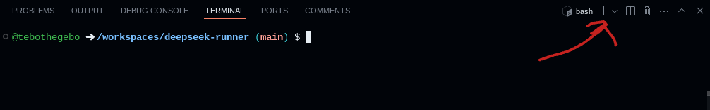

# How to set this up once inside github.dev (if you have not already, visit https://tebothegebo.github.io/deepseek-runner)
Press `ctrl + ~` to open the terminal. When opened, you will see a button to create a codespace or something along those lines. 
Click the button to create a codespace. 
A popup window will show up asking what specs you want for the codespace. You need to click the one with 16 gigabytes of RAM or it usually will not run. 
Once the codespace opens, open the terminal with `ctrl + ~` if you haven't already. 
Add a tab to your terminal, which I'll call tab two from now on.

Switch to your first tab, and type `curl -fsSL https://ollama.com/install.sh | sh` 
Now, type `ollama serve` and press enter. 
Switch to tab two, type `ollama run deepseek-r1`. You can interact with this AI by typing prompts, and you can exit with `/bye`. 
To start it up again after closing the tab, go back to your codespace, which you can find [here](https://github.com/codespaces), and do all the same things starting from running `ollama serve` in the first tab.
